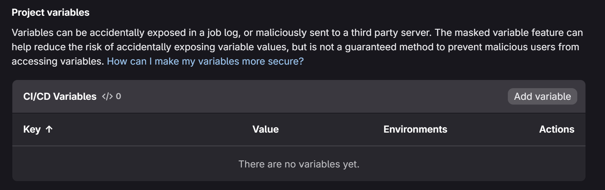
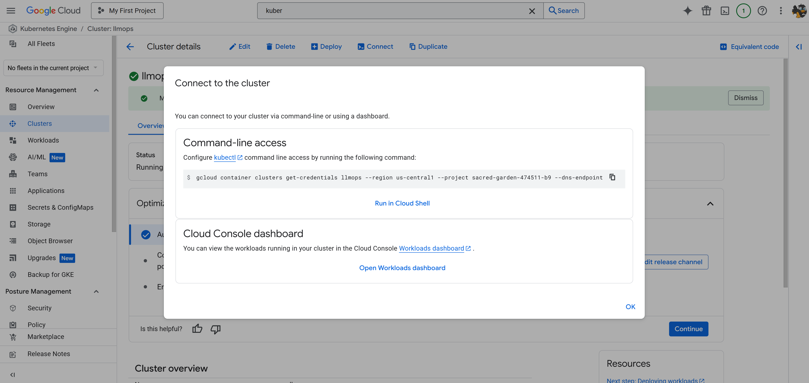
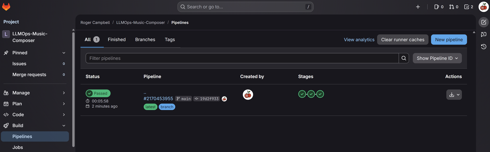
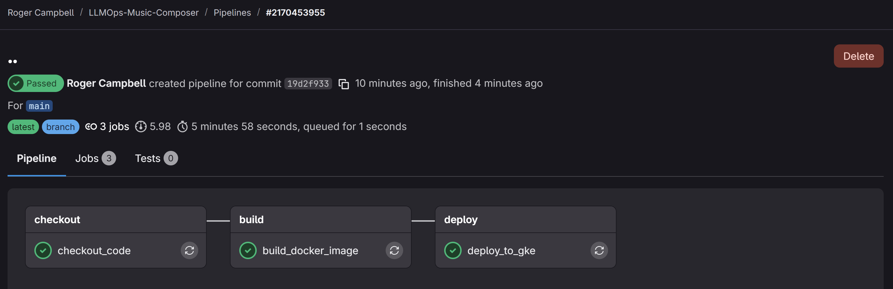
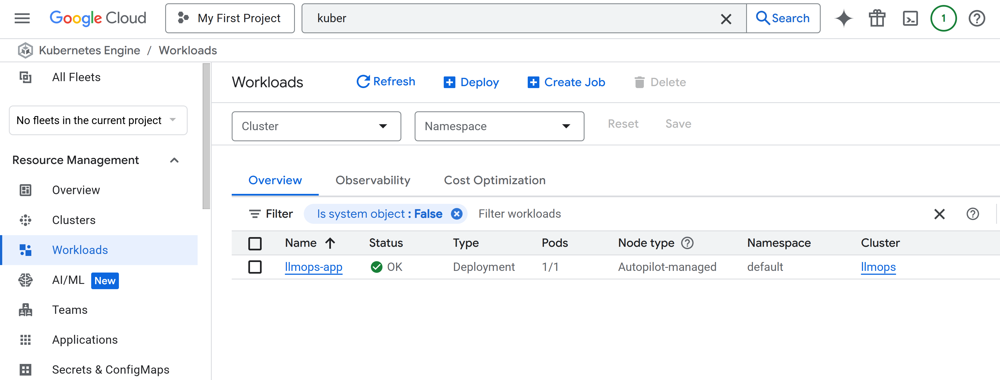
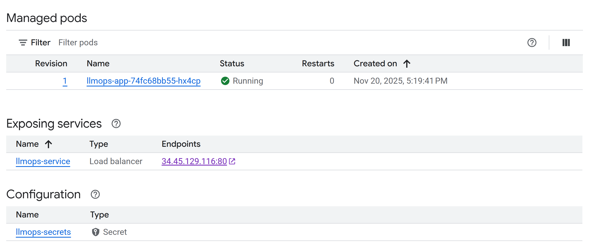

# 🛠️ **GitLab CI/CD Setup — LLMOps Music Composer**

This branch introduces the **full continuous integration and deployment pipeline** for the LLMOps Music Composer using **GitLab CI/CD**.
The pipeline handles:

* Secure authentication with GCP
* Docker image building
* Artifact Registry uploads
* Automatic deployment to GKE
* Secret management for LLM access

This is the branch that turns the Music Composer into a **fully automated, cloud-deployed system**.

<p align="center">
  
</p>

## 🗂️ **Updated Project Structure**

Only the **new CI/CD file** is annotated here.

```text
LLMOPS-MUSIC-COMPOSER/
├── .venv/
├── .env
├── .gitignore
├── .python-version
├── pyproject.toml
├── README.md
├── requirements.txt
├── setup.py
├── llmops_music_composer.egg-info/
├── img/                      # GitLab CI/CD screenshots added here
│
├── app/
│   ├── __init__.py
│   ├── utils.py
│   └── main.py
│
├── application.py
├── Dockerfile
├── kubernetes-deployment.yaml
└── .gitlab-ci.yml            # NEW: Full GitLab CI/CD pipeline config
```


# 🔐 **1. Convert Service Account Key to Base64**

To securely store the GCP service account key in GitLab, convert it to base64:

```bash
cat gcp-key.json | base64 -w 0
```

Copy the output — this is what you’ll paste into GitLab CI/CD variables as `GCP_SA_KEY`.


# 🔐 **2. Add `GCP_SA_KEY` to GitLab CI/CD Variables**

1. Go to your GitLab project
2. **Settings → CI/CD → Variables**
3. Click **Add Variable**

<p align="center">
  
</p>

Add:

* **Key:** `GCP_SA_KEY`
* **Value:** *(paste the base64 from the previous step)*

This allows GitLab runners to authenticate with Google Cloud automatically.


# ☸️ **3. Create Secrets in GKE (GROQ API Key)**

### **Access your GKE Cluster**

In the GCP Console, open **GKE → kubectl terminal** or configure your local CLI:

```bash
gcloud container clusters get-credentials llmops \
  --region us-central1 \
  --project sacred-garden-474511-b9
```

<p align="center">
  
</p>


### **Create Kubernetes Secret**

```bash
kubectl create secret generic llmops-secrets \
  --from-literal=GROQ_API_KEY="your_actual_groq_api_key"
```

This secret is used by the deployment yaml:

```yaml
env:
- name: GROQ_API_KEY
  valueFrom:
    secretKeyRef:
      name: llmops-secrets
      key: GROQ_API_KEY
```


# ⚙️ **4. Configure GitLab CI/CD Pipeline**

Add the provided `.gitlab-ci.yml` file to the **root directory** of your project.

This pipeline:

* Installs Docker CLI
* Authenticates to GCP using the base64 key
* Builds your Docker container
* Pushes to Artifact Registry
* Deploys to GKE

Once this file exists, every push to GitLab automatically triggers CI/CD.


# 🚀 **5. Triggering and Monitoring Pipelines**

GitLab will automatically run the pipeline when you:

* Push a commit
* Merge into `main`
* Manually trigger from Pipelines menu

Open:

**Left Sidebar → Build → Pipelines**

<p align="center">
  
</p>

Click into a run to inspect logs:

<p align="center">
  
</p>


# 🌐 **6. View Your Application on GKE**

Once the deploy stage completes:

1. Go to **GKE → Workloads**
2. Find `llmops-app`

<p align="center">
  
</p>

Scroll to the **Exposing services** section at the bottom:

<p align="center">
  
</p>

Use the external endpoint shown there to open the **live deployed LLMOps Music Composer** in your browser.


# ✅ **Summary**

This branch enables:

✔ Automatic Docker builds
✔ Automatic GKE deployments
✔ Secure storage of API keys
✔ GKE secrets for LLM access
✔ Fully automated, cloud-native CI/CD workflow

This is the branch that completes the operational backbone of the project — every code push becomes a live deployment.