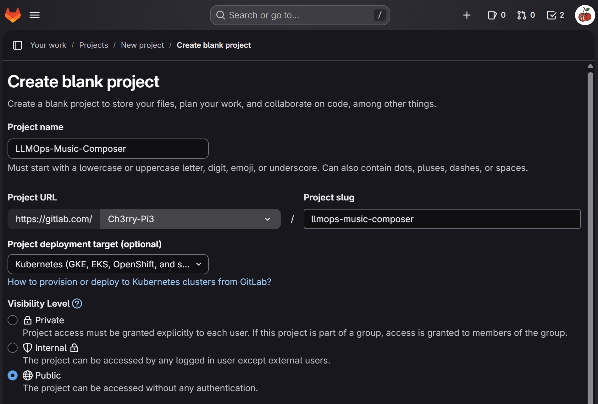

# 🚀 **GitLab Project Setup — LLMOps Music Composer**

This branch introduces the version-control setup for GitLab.
The purpose here is to prepare the repository for future **GitLab CI/CD pipelines**, which will handle automated building, testing, and deployment of the music composer application.

A new GitLab project is created, and the local repository is connected to it using a new remote.
This ensures your project can be pushed to GitLab without interfering with your existing GitHub or other remotes.

<p align="center">
  
</p>

## 🗂️ **Updated Project Structure**

Only the **new integration step** is annotated here — no new code files were added, but the repository now includes a GitLab remote.

```text
LLMOPS-MUSIC-COMPOSER/
├── .venv/
├── .env
├── .gitignore
├── .python-version
├── pyproject.toml
├── README.md
├── requirements.txt
├── setup.py
├── llmops_music_composer.egg-info/
├── IMG/
│   ├── Streamlit/
│   │   └── streamlit_app.gif
│   └── gitlab/
│       └── new_project.png        # NEW: Screenshot of GitLab project creation
├── app/
│   ├── __init__.py
│   ├── utils.py
│   └── main.py
└── application.py
```

## 🧩 **What This Branch Introduces**

### 🛠️ GitLab Project Creation

1. Create a GitLab account at
   **[https://gitlab.com](https://gitlab.com)**
2. Create a **new blank public project**.
3. For *Project deployment target*, select:
   **Kubernetes (GKE, EKS, OpenShift, etc.)**

This prepares the repository for upcoming GitLab CI/CD workflows and Kubernetes deployments.

---

## 🌐 **Code Versioning with GitLab**

If this project is *not* currently linked to any remote:

```bash
git init
git branch -M main
git remote add origin https://gitlab.com/your-username/your-repo.git
git add .
git commit -m "Initial commit"
git push origin main
```

## 🔄 **If You Are Already Pushing to GitHub**

Use a **second remote** so GitHub remains untouched:

```bash
git remote add gitlab https://gitlab.com/your-username/your-repo.git
git add .
git commit -m "Initial commit"
git push gitlab main
```

This preserves your GitHub workflow while enabling GitLab CI/CD pipelines to operate independently.
